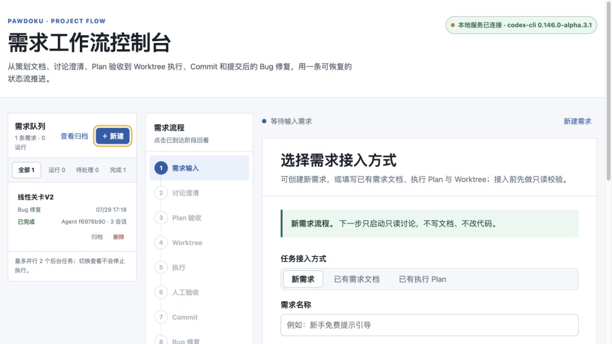
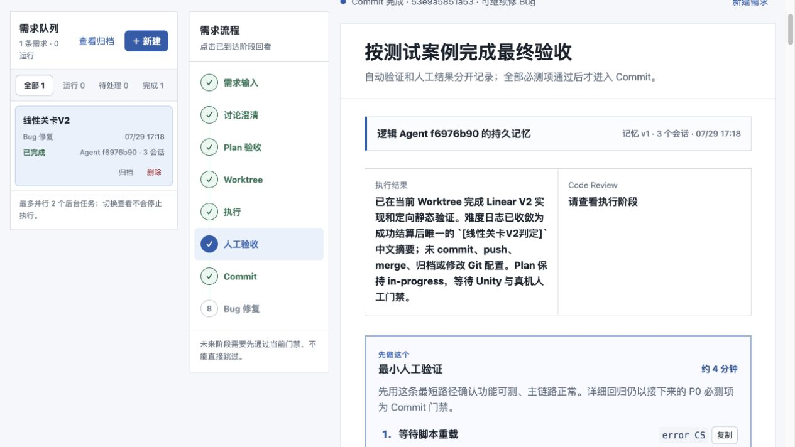
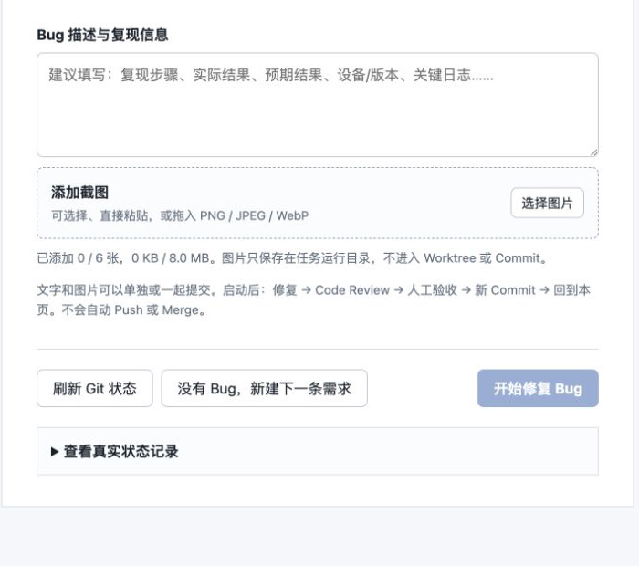

# Project Flow Console

一个运行在本机的、多项目需求交付控制台。

它通过 Project Profile 适配不同 Git 项目，把下面这些原本散落在对话、终端和文档里的步骤，收拢成一条可恢复、可人工审批的工作流：

> 需求输入 → 只读讨论 → Plan / HTML 验收 → Git Worktree → 快速修改或标准执行 → 人工验收 → Commit → Bug 返修

每条任务还提供独立的 **Ask · 只读问答** 模块，可以随时询问当前实现、状态来源、相关文件和修改影响；Ask 不属于流程阶段，不会修改文件或改变任务状态。

控制台支持多个需求并行排队、任务切换、归档与恢复，也支持接入已经存在的需求文档、Plan 和 Worktree。

## 界面预览

### 从需求输入开始

通过任务队列切换多个需求，并沿左侧流程导航查看每个需求所处阶段。新需求可以粘贴链接、上传文档或直接粘贴正文，也可以接入已有需求文档、Plan 和 Worktree。



### 人工验收与测试门禁

执行完成后，控制台会给出最小人工验证路径、详细测试用例和关键日志筛选词；P0 / 必测项全部通过后才能进入 Commit。



### 文字和截图一起反馈

人工验收返修与 Commit 后 Bug 修复都支持文字、截图或两者组合提交；图片可以选择、粘贴或拖入，只保存在本地任务运行目录，不会进入 Worktree 或 Commit。



## 主要能力

- 输入网页链接、上传文档或直接粘贴需求内容。
- 先运行只读 discussion / ask-first，再生成执行 Plan。
- 同时输出 Markdown Plan 和自包含的逻辑验收 HTML。
- 创建 Worktree 前先展示真实 dry-run；也可以接入已有 Worktree。
- 每个需求可绑定一个持久 Codex App Thread，并通过 `codex://threads/<thread-id>` 直接打开。
- 快速修改复用同一个 App Thread，一轮完成实现和自检；标准流程保留独立 Code Review。
- 在任务绑定的 Worktree 中执行 Codex 和项目 Skills。
- 将实施与 Code Review 分开，Review 不通过时进入定向修复。
- 生成人工验收最短路径、详细测试案例和关键日志筛选词。
- 人工验收返修和 Commit 后 Bug 修复都可附加多张截图，支持选择、粘贴、拖入、预览和单张删除。
- Commit 前重新校验真实 Git 状态，防止确认后文件又发生变化。
- Commit 后发现问题时，复用当前 Worktree 和任务记忆，在 Bug 修复模块内完成定向修改、Review、复验和新 Commit，不重新执行 Plan。
- 每个任务提供独立 Ask 只读问答，可询问当前实现、状态来源、相关文件和修改影响范围，不改变任务阶段。
- 多需求队列可切换查看，支持归档、删除、恢复和有限并行。
- 每个项目由独立 Profile 配置，不在服务代码中写死路径。

## 运行环境

必需：

- Python 3.10 或更高版本
- Git，并支持 `git worktree`
- 可正常运行的 Codex CLI
- 一个本地 Git 项目

可选：

- Node.js：只在执行 `app.js` 语法检查时需要。
- Chrome MCP / `$chrome:control-chrome`：读取需要登录态的飞书或 Lark 文档时需要。
- 项目 Skills：Profile 中引用的 Skill 必须已能被 Codex 发现。

服务端只使用 Python 标准库，不需要执行 `pip install`。

## 目录结构

```text
ProjectFlowConsole/
├── server.py
├── app.js
├── index.html
├── start.command
├── profiles/
│   └── example.json                  # 不含个人路径的通用 Profile 模板
├── schemas/                          # Codex 结构化输出协议
├── scripts/
│   └── create_git_worktree.py        # 通用 Git Worktree provider
├── skills/
│   └── project-flow-setup/            # 为新项目生成 Profile 的 Skill
└── tests/
```

运行时状态保存在：

```text
.runtime/<project-id>/tasks/
```

不同 Profile 的任务队列和任务记忆互相隔离，`.runtime/` 已加入 `.gitignore`。

## 5 分钟快速开始

### 1. 获取代码

```bash
git clone https://github.com/CandyAlla/project-flow-console.git
cd ProjectFlowConsole
```

### 2. 安装配置 Skill

Skill 的唯一源文件位于本工具目录：

```text
skills/project-flow-setup
```

推荐使用软链接让 Codex 自动发现它：

```bash
mkdir -p ~/.codex/skills
ln -s "$PWD/skills/project-flow-setup" ~/.codex/skills/project-flow-setup
```

如果目标路径已存在，先检查它是否已经指向当前工具，不要直接覆盖。安装后新建一个 Codex 任务，即可调用 `$project-flow-setup`。

### 3. 为项目生成 Profile

在 Codex 中输入：

```text
使用 $project-flow-setup 配置 /absolute/path/to/your-project
```

Skill 会先只读扫描：

- Git 根目录、当前分支和未完成的 Git 操作
- `AGENTS.md`、工程手册与项目事实入口
- `Doc/Skills`、`Docs/Skills`、`.codex/skills` 等 Skill 目录
- 文档、Worktree、Plan 和 HTML 的建议路径
- 是否存在 `.gitmodules`

它会先执行 dry-run。确认路径、分支和 Skill 链正确后，再生成：

```text
profiles/<project-id>.json
```

也可以不通过 Codex，直接运行确定性脚本：

```bash
python3 skills/project-flow-setup/scripts/configure_project.py \
  /absolute/path/to/your-project \
  --dry-run

python3 skills/project-flow-setup/scripts/configure_project.py \
  /absolute/path/to/your-project
```

常用的自定义示例：

```bash
python3 skills/project-flow-setup/scripts/configure_project.py \
  /absolute/path/to/your-project \
  --name "My Project" \
  --id my-project \
  --base develop \
  --docs-root /absolute/path/to/MyProjectDocs \
  --worktrees-root /absolute/path/to/worktrees \
  --verification-source "Application Log" \
  --verification-source "Test Report" \
  --dry-run
```

使用 `--help` 查看全部参数：

```bash
python3 skills/project-flow-setup/scripts/configure_project.py --help
```

### 4. 启动控制台

首次使用或从 GitHub 新克隆后，建议显式设置 Profile：

```bash
PROJECT_FLOW_PROFILE="$PWD/profiles/my-project.json" python3 server.py
```

也可以临时覆盖端口：

```bash
PROJECT_FLOW_PROFILE="$PWD/profiles/my-project.json" \
python3 server.py --port 4320
```

macOS 可以使用：

```bash
PROJECT_FLOW_PROFILE="$PWD/profiles/my-project.json" ./start.command
```

服务只监听 `127.0.0.1`。启动日志会打印实际地址，例如：

```text
My Project Project Flow: http://127.0.0.1:4318/
```

在浏览器打开该地址即可。

## 如何使用控制台

| 阶段 | 发生什么 | 写入边界 |
|---|---|---|
| 需求输入 | 输入链接、文件、正文，或接入已有文档和 Worktree | 上传文件仅进入本地任务目录 |
| 讨论澄清 | Codex 读取项目事实并提出 1–3 个高返工问题 | 严格只读 |
| Plan 验收 | 生成 Markdown Plan 和逻辑验收 HTML | 服务落地草案，不实施代码 |
| Worktree | 先预览，再创建或绑定隔离 Worktree | 需要单独点击批准 |
| 执行 | 在 Worktree 内执行 Plan 和项目 Skill 链 | 不自动 Commit、Push、Merge |
| 人工验收 | 展示最小验证步骤、详细用例和验收日志；问题反馈可填写文字或附截图 | 用户逐项确认 P0 / 必测项；截图仅进入任务运行目录 |
| Commit | 刷新 Git 摘要并校验状态指纹 | 需要单独确认；只提交当前 Worktree |
| Bug 修复 | 根据文字、截图或两者组合，在本模块内完成定向修改、Review、人工复验和新 Commit | 不重新执行 Plan；复用当前 Worktree，不重写旧 Commit |
| Ask | 基于当前任务、Plan、持久记忆和 Worktree 回答实现问题 | 严格只读，不修改文件，不改变流程阶段 |

任务在后台运行时可以切换查看其他需求。服务重启后，进行中的操作会标记为中断，已有文档和 Worktree 改动会保留，可从对应阶段重试。

## Codex App 联动与两种执行模式

任务创建后，页面顶部会出现“Codex App 联动”面板。点击“连接并在 Codex App 打开”后，控制台会通过官方 [Codex App Server](https://learn.chatgpt.com/docs/app-server.md) 协议创建持久 Thread，并记录到当前任务：

```text
task.sessions.app
task.app.threadId
task.app.deepLink
task.app.cwd
```

每次点击“打开 Codex App”都会先通过本地控制服务恢复同一个 Thread，并同步当前项目目录，然后才跳转到 App，不会重复创建 Thread。Worktree 已准备完成且目录有效时连接该 Worktree；否则连接 Project Profile 的 `repoRoot`。因此即使 Thread 在 Worktree 创建前已经绑定，之后再次打开也会自动切换到对应 Worktree。控制台继续负责流程状态、验收证据和 Git 门禁，Codex App 用于交互式查看与补充指令。

| 模式 | 执行方式 | 独立 Review | 适合场景 |
|---|---|---|---|
| 快速修改（默认） | 持久 `codex app-server` Thread，一轮实现并自检 | 跳过；页面明确标记 `skipped` | 小改动、验收返修、定向 Bug 修复 |
| 标准流程 | 原有 `codex exec` 实施会话，再运行独立只读 Review | 保留 | 大改动、共享逻辑、高风险需求 |

两种模式都会保留：

- 当前 Worktree 的写入边界。
- 最小人工验证步骤、详细测试案例和关键日志。
- P0 / 必测人工验收门禁。
- Commit 前真实 Git 状态与指纹复核。
- 不自动 Push 或 Merge。

快速模式只是省去第二个独立 Review，不会把“未 Review”伪装成“Review 通过”。用户停止快速任务时，服务只中断当前需求的 Turn，不会结束其他需求共享的 App Server 进程。

已有 `.runtime`、任务、Worktree 以及 discussion / execution / review / ask session 会在加载时兼容迁移；不使用快速模式时，原有标准流程行为保持不变。

快速 Turn 默认最长 360 秒，可在启动前调整为 120–900 秒：

```bash
PROJECT_FLOW_QUICK_TIMEOUT=480 \
PROJECT_FLOW_PROFILE="$PWD/profiles/my-project.json" \
python3 server.py
```

## 接入已有文档和 Worktree

控制台支持两种已有资产入口：

### 已有需求文档

- 填写需求文档绝对路径。
- 填写已有 linked Worktree 的绝对路径。
- 校验通过后，从只读讨论阶段继续。

### 已有执行 Plan

- Plan 必须是 UTF-8 Markdown。
- Plan 必须位于所填 Worktree，或 Profile 配置的 `docsRoot` 内。
- Worktree 必须属于 Profile 中的同一个主仓库。
- 校验通过后直接进入执行授权阶段，不重新生成 Plan。

服务会拒绝：

- 把主仓库本身当作 Worktree。
- 其他 Git 仓库的 Worktree。
- detached HEAD。
- 分支已经变化的已绑定 Worktree。
- 存在未完成 Merge、Rebase、Cherry-pick 或 Revert 的仓库。

## Project Profile

Profile 是控制台与项目之间唯一的配置协议。核心示例：

```json
{
  "schemaVersion": 1,
  "id": "my-project",
  "name": "My Project",
  "workspaceRoot": "/absolute/path/to/workspace",
  "repoRoot": "/absolute/path/to/workspace/my-project",
  "docsRoot": "/absolute/path/to/workspace/MyProjectDocs",
  "worktreesRoot": "/absolute/path/to/workspace/worktrees",
  "htmlTaskRoot": "/absolute/path/to/workspace/MyProjectDocs/Tasks/进行中",
  "defaultBaseBranch": "develop",
  "worktreeNamePrefix": "MyProject",
  "planRelativeDir": "Docs/plans/active",
  "projectFacts": [
    "AGENTS.md",
    "Docs/index.md",
    "Docs/Skills/README.md"
  ],
  "planTemplate": "Docs/rules/plan-template.md",
  "skills": {
    "discussion": ["discussion-only", "ask-first"],
    "plan": ["clear-html"],
    "execution": ["workmission", "change-guard"],
    "acceptanceFix": ["change-guard"],
    "review": ["code-review"]
  },
  "verification": {
    "sources": ["Application Log", "Test Report"],
    "policy": "AI 运行可自动化测试；设备验证由用户完成。"
  },
  "capabilities": {
    "initializeSubmodules": false
  },
  "port": 4318
}
```

关键规则：

- 所有根目录必须使用绝对路径。
- `repoRoot` 必须是准确的 Git 根目录。
- `worktreesRoot` 不能等于或位于 `repoRoot` 内部。
- `htmlTaskRoot` 必须位于 `docsRoot` 内。
- `planRelativeDir`、`projectFacts` 和 `planTemplate` 必须是仓库内相对路径，不能包含 `..`。
- Skill 名必须是小写 kebab-case，并且已经能被 Codex 发现。
- Profile 是声明式数据，不能包含任意 shell、Hook 或 Git provider 命令。

完整字段说明见：

```text
skills/project-flow-setup/references/profile-schema.md
```

## 多任务与并行

默认最多同时运行 2 个后台任务，其余任务进入队列。可以在启动前调整为 1–4：

```bash
PROJECT_FLOW_CONCURRENCY=4 \
PROJECT_FLOW_PROFILE="$PWD/profiles/my-project.json" \
python3 server.py
```

每条需求拥有独立的：

- 状态记录
- Codex discussion / execution / review / ask 会话槽
- Codex App 持久 Thread 槽
- 持久任务记忆
- Plan、HTML 和 Worktree 绑定信息

它不是“每个需求常驻一个一直运行的 Agent”。后台 Worker 只在阶段执行时占用资源，任务上下文通过结构化状态、Codex session id、Plan 和 Git 指纹恢复。

## 飞书 / Lark 文档

当输入 `feishu.cn`、`larksuite.com` 或 `larkoffice.com` 链接时，讨论 Prompt 会强制要求使用 `$chrome:control-chrome`，复用用户当前 Chrome 登录态只读打开页面。

它不会编辑、评论、分享或上传内容。如果 Chrome 未连接、未登录或没有权限，任务会返回明确阻塞；此时可以改用上传文档或粘贴正文。

## Git 安全边界

内置 Worktree provider 会：

- 校验 Git 根目录、当前分支、基准 ref 和未完成 Git 操作。
- 展示当前主仓库状态和已有 Worktree。
- 先输出 dry-run，再执行 `git worktree add`。
- 创建后核对 Worktree 根、分支和 HEAD。
- 仅在 Profile 开启时初始化并验证 Submodule。

它不会：

- Fetch、Pull、Push 或 Merge。
- 切换主仓库分支。
- 修改 Git config。
- 删除或覆盖已经存在的 Worktree。
- 自动提交代码。

控制台的 Commit 操作也有独立门禁：人工验收通过后，服务会重新读取文件列表和 Git 状态指纹；如果状态发生变化，Commit 会被拒绝并要求重新确认。

## 本地服务安全

- 只监听 `127.0.0.1`。
- 拒绝非 localhost Host。
- 修改类 API 需要当前服务生成的会话令牌。
- 上传和请求体有大小限制。
- 反馈截图仅支持 PNG、JPEG、WebP，一次最多 6 张、单张最多 4 MB、总计最多 8 MB。
- 反馈截图保存在 `.runtime/<project-id>/tasks/<task-id>/feedback-images/`，标准模式通过 Codex CLI `--image` 读取，快速模式通过 App Server `localImage` 输入读取；不复制到 Worktree，也不会进入 Commit。
- Codex 阶段使用明确的 read-only 或 workspace-write sandbox。
- 需求网页、文档和粘贴内容一律按不可信输入处理。

这个工具会在用户点击授权后运行 Codex、创建 Worktree 和执行 Commit。使用前仍应检查 Project Profile、目标仓库和 Worktree 路径。

## 测试

运行完整测试：

```bash
python3 -m unittest discover -s tests -v
```

补充语法检查：

```bash
node --check app.js
python3 -m py_compile \
  server.py \
  scripts/create_git_worktree.py \
  skills/project-flow-setup/scripts/configure_project.py
```

测试覆盖控制器门禁、任务队列、归档恢复、Git 指纹、人工验收、Commit、返修、App Thread 创建与复用、快速模式、旧任务迁移、Profile 校验、配置脚本，以及通用 Worktree provider。

## 常见问题

### 为什么最多只有两个后台任务？

默认并行数是 2，避免多个 Codex 和 Git 操作同时抢占本机资源。通过 `PROJECT_FLOW_CONCURRENCY` 可调整为 1–4。

### Profile 已存在，配置脚本拒绝写入怎么办？

先比较 dry-run 输出与已有 Profile。只有确认需要替换时才使用 `--force`，脚本默认不会覆盖已有配置。

### 服务重启后任务还在吗？

在。任务记录位于 `.runtime/<project-id>/tasks`。重启时正在运行的阶段会变成 `interrupted`，已有 Worktree 改动不会被清理。

### 快速模式为什么更快？

它复用当前需求的持久 App Thread，并把实现和自检合并为一轮，不再等待第二个独立 Review。人工验收和 Commit 门禁仍然保留；共享逻辑或高风险改动建议切换到标准流程。

### 不打开 Codex App 还能使用吗？

可以。标准流程继续使用原有 `codex exec`。选择快速模式时，服务会自动创建或恢复任务的 App Thread；“打开 Codex App”只是把同一个 Thread 显示到桌面 App，便于交互式跟进。

### 会自动 Push 或合并吗？

不会。当前流程最多执行本地 Commit，Push 和 Merge 不在控制台授权范围内。

### 可以不让控制台执行 Commit 吗？

可以。你可以人工提交，然后点击“确认已人工提交”。控制台只记录当前 HEAD，不会再次执行 Git Commit。

## GitHub 发布前检查

本地 Project Profile 通常包含机器绝对路径，因此 `.gitignore` 默认排除 `profiles/*.json`，只提交 `profiles/example.json`。

建议发布前完成：

1. 确认只提交不含个人路径的 `profiles/example.json`。
2. 确认 `.runtime/`、上传文档、任务状态和日志没有进入 Git。
3. 搜索用户名、绝对路径、项目私有地址和内部 Skill 名称。
4. 补充合适的 `LICENSE`；当前工具没有替你选择开源许可证。
5. 在一个临时 Git 项目上重新执行 dry-run、Profile 生成和完整测试。

## License

尚未指定。发布到 GitHub 前请根据项目用途添加合适的许可证文件。
